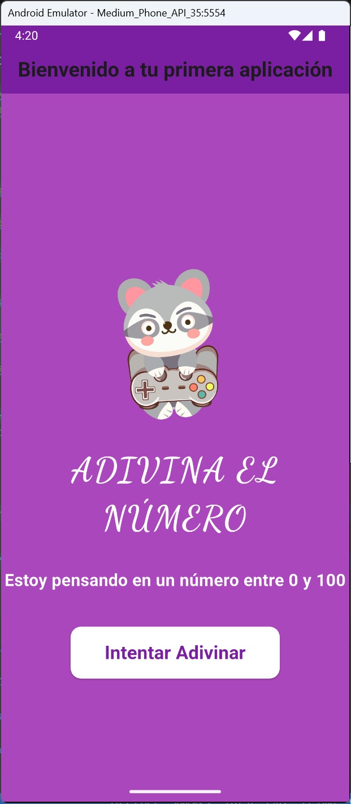

# Adivina el Número - Mi primera aplicacion movil

Bienvenido al repositorio de la aplicación móvil "Adivina el Número". Esta es una aplicación interactiva construida con Flutter, en la que los usuarios intentan adivinar un número aleatorio generado entre 0 y 100. La aplicación les dará pistas para adivinar el número hasta que lo consigan.

## Requisitos

- Flutter 3.x o superior.
- Dart 2.x o superior.
- Un emulador de Android o un dispositivo físico para probar la aplicación.

## Funcionalidades

1. **Pantalla de bienvenida**:
   - El juego muestra una pantalla inicial con las reglas del juego.
   - Hay un botón para empezar el juego, que genera un número aleatorio entre 0 y 100.

2. **Pantalla de adivinar el número**:
   - El jugador puede usar un control deslizante (slider) para seleccionar un número entre 0 y 100.
   - Cuando el jugador presiona el botón para adivinar, la aplicación verifica si el número es mayor o menor que el número secreto.
   - La aplicación da pistas dependiendo de si el número seleccionado es mayor o menor.
   
3. **Pantalla de felicitaciones**:
   - Cuando el usuario adivina el número, se muestra un mensaje de felicitaciones junto con el número correcto.
   - Se presenta un botón para regresar a la pantalla de bienvenida.

## Instalación

1. Clona este repositorio en tu máquina local:

   ```bash
   https://github.com/Dora-tech/juegoadivina_app.git

2. **Entra en el directorio del proyecto**:

    ```bash
    cd juegoadivina_app

3. **Asegúrate de tener Flutter y Dart instalados**. Si no los tienes, puedes seguir las instrucciones en la [documentación oficial de Flutter](https://flutter.dev/docs/get-started/install).

4. **Instala las dependencias del proyecto ejecutando**:

    ```bash
    flutter pub get
    ```

5. **Corre la aplicación**:

    ```bash
    flutter run
    ```

## Uso

1. Cuando la aplicación se inicie, se mostrará la pantalla de bienvenida con un botón para comenzar.
2. Presiona el botón "Intentar Adivinar" para comenzar a jugar.
3. Usa el control deslizante para seleccionar tu intento.
4. El juego te dirá si el número seleccionado es mayor o menor que el número secreto.
5. Si aciertas, se te felicitará y podrás regresar a la pantalla de inicio.

## Video de demostración

Puedes ver cómo funciona la aplicación a continuación:

[Video de demostración](https://drive.google.com/file/d/1KIrcXbQW5bpk2aZXpL3waSyHO07KBv35/view?usp=sharing)

<p align="center">
  
</p>